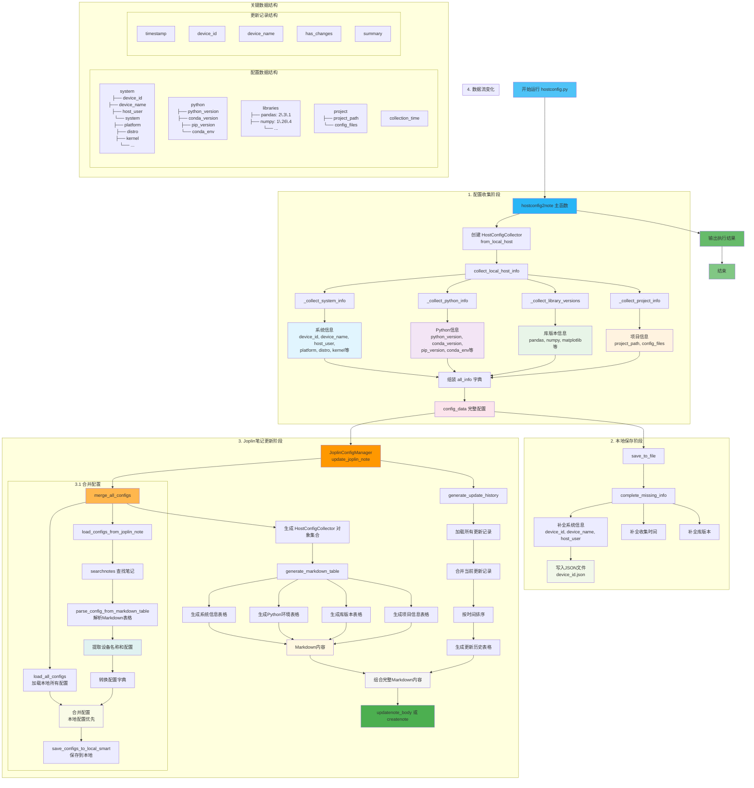
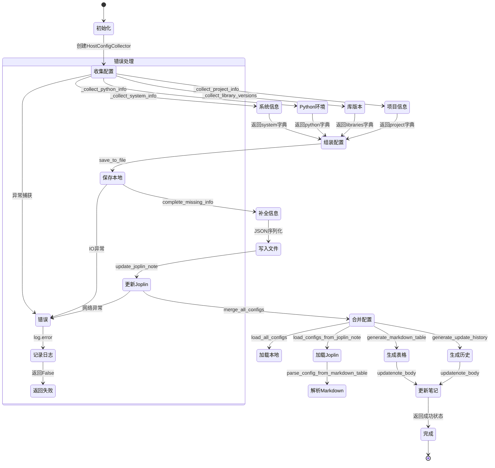

# hostconfig

主机配置自动搜集对比工具。收集各主机（Linux/Windows/macOS）的系统信息、Python环境、库版本和项目配置，保存到本地JSON文件，并自动同步到Joplin笔记中，生成多主机配置对比表格。

---

## 目录结构

```
hostconfig/
├── hostconfig.py         # 主程序：配置收集器 + Joplin笔记管理器
├── hostconfig.ipynb      # Jupyter Notebook 版本（jupytext 同步）
├── pathmagic.py           # 路径魔法模块，扩展 sys.path
├── pathmagic.ipynb        # Notebook 版本
├── rootfile               # 项目根目录定位文件（func 子模块依赖）
├── README.md              # 项目文档
├── LICENSE                # 许可证
├── .gitignore             # Git 忽略规则
├── .gitmodules            # Git 子模块配置（func）
├── data/                  # 数据目录
│   ├── happyjp.ini        # Joplin API 基础配置
│   ├── happyjphard.ini    # Joplin API 硬件相关配置
│   ├── happyjpinifromcloud.ini  # 云端同步的设备映射配置
│   ├── happyjpsys.ini     # 系统参数配置
│   └── hostconfig/        # 主机配置数据存储目录
│       ├── *.json          # 各设备的配置快照
│       └── *_updates.json  # 各设备的更新记录
├── log/                   # 日志目录
│   └── happyjoplin.log    # 运行日志
└── func/                  # Git 子模块：常用工具函数库
    ├── common/utils.py    # Shell 命令执行工具
    ├── configpr.py        # INI 配置文件读写
    ├── datatools.py       # 数据处理工具
    ├── datetimetools.py   # 日期时间处理
    ├── evernttest.py      # 事件测试
    ├── filedatafunc.py    # 文件数据函数
    ├── first.py           # 项目路径初始化（getdirmain/dirmainpath）
    ├── getid.py           # 设备ID/名称/用户获取
    ├── jpfuncs.py         # Joplin API 封装（搜索/创建/更新笔记）
    ├── litetools.py       # 轻量工具集
    ├── logme.py           # 日志模块（log.info/warning/error/debug）
    ├── nettools.py        # 网络工具
    ├── pdtools.py         # Pandas 数据处理工具
    ├── sysfunc.py         # 系统函数（execcmd/not_IPython）
    ├── termuxtools.py     # Termux 工具
    └── wrapfuncs.py       # 装饰器工具（timethis等）
```

---

## 快速开始

### 1. 克隆项目

```bash
git clone --recurse-submodules https://github.com/heart5/hostconfig.git
cd hostconfig
```

`--recurse-submodules` 确保同时拉取 `func` 子模块。如果已克隆但缺少子模块：

```bash
git submodule update --init --recursive
```

### 2. 配置 Joplin API

在 `data/` 目录下配置 INI 文件：

- **happyjp.ini** — Joplin Web Clipper API 地址和 token
- **happyjphard.ini** — 硬件相关 Joplin 配置
- **happyjpinifromcloud.ini** — 云端设备名称到 device_id 的映射
- **happyjpsys.ini** — 系统参数（如 FORCE_UPDATE 等）

### 3. 创建定位文件

在项目根目录创建空文件 `rootfile`（func 子模块用它来定位项目根目录）：

```bash
touch rootfile
```

### 4. 运行

```bash
python hostconfig.py
```

在 Jupyter 中打开 `hostconfig.ipynb` 直接运行所有单元格亦可。

---

## 核心架构

### 类与职责

| 类名 | 职责 |
|:---|:---|
| `BaseConfigCollector` | 配置收集器基类，管理设备ID/名称/用户/配置目录/文件路径等属性 |
| `HostConfigCollector` | 主机配置收集器，继承基类，实现系统/Python/库/项目信息的收集、保存、比较 |
| `JoplinConfigManager` | Joplin笔记管理器，负责多主机配置的加载、合并、Markdown表格生成、笔记同步 |

### 关键函数

| 函数 | 说明 |
|:---|:---|
| `hostconfig2note()` | 主入口，串联收集→保存→对比→更新Joplin笔记全流程 |
| `get_libs_from_cloud(config_key)` | 从云端INI配置获取待监测的库列表，支持逗号/分号/空格/换行分隔 |
| `format_timestamp(timestamp)` | 统一格式化ISO时间戳为 `YYYY-MM-DD HH:MM:SS` |
| `collect_local_host_info()` | 收集系统信息+Python环境+库版本+项目信息，返回完整字典 |
| `save_to_file(file_path)` | 补全缺失信息后保存配置到JSON文件 |
| `compare_with(other)` | 与另一台主机的配置逐项比较差异 |
| `validate_config()` | 校验配置完整性，返回 (通过, 错误列表) |
| `generate_markdown_table(collectors)` | 生成多主机Markdown对比表格（系统/Python/库/项目/收集时间） |
| `generate_update_history(records)` | 生成所有主机的更新历史Markdown表格 |
| `update_joplin_note(config, record)` | 将最新配置同步到Joplin笔记，合并历史记录 |
| `parse_configs_updates_from_markdown_table(md)` | 从Markdown表格反向解析配置和更新记录 |
| `load_configs_updates_from_joplin_note()` | 从Joplin笔记加载所有主机配置和更新记录 |
| `merge_configs(parsed, local)` | 合并笔记配置和本地配置（本地优先） |
| `save_collectors_to_local_smart(configs)` | 智能保存配置到本地（比较时间戳和内容变化） |







---

## 数据结构

### 配置快照 JSON (`{device_id}.json`)

```json
{
  "system": {
    "device_id": "0x1070835fe6e5d115",
    "device_name": "my-server",
    "host_user": "baiyefeng",
    "timestamp": "2026-03-22T16:30:00",
    "system": {
      "platform": "Linux-4.15.0",
      "system": "Linux",
      "release": "4.15.0-249-generic",
      "version": "#249-Ubuntu SMP",
      "machine": "x86_64",
      "processor": "x86_64",
      "architecture": ["64bit", "ELF"],
      "distro": "Ubuntu 20.04 LTS",
      "kernel": "4.15.0-249-generic"
    }
  },
  "python": {
    "python_version": "3.10.0",
    "python_implementation": "CPython",
    "conda_version": "conda 23.1.0",
    "pip_version": "pip 23.0.1",
    "virtual_env": "N/A",
    "conda_env": "base"
  },
  "libraries": {
    "pandas": "2.3.1",
    "numpy": "1.26.4",
    "matplotlib": "3.8.0"
  },
  "project": {
    "project_path": "/data/codebase/hostconfig",
    "config_files": {
      "requirements.txt": {"exists": true, "size": 256, "modified": "..."}
    }
  },
  "collection_time": "2026-03-22T16:30:00"
}
```

### 更新记录 JSON (`{device_id}_updates.json`)

```json
[
  {
    "timestamp": "2026-03-22 16:30",
    "device_id": "0x1070835fe6e5d115",
    "device_name": "my-server",
    "has_changes": true,
    "summary": "配置变化: system, python, libraries"
  }
]
```

---

## 配置文件说明

| 文件 | 格式 | 用途 |
|:---|:---|:---|
| `data/happyjp.ini` | INI | Joplin API 连接配置（URL、token） |
| `data/happyjphard.ini` | INI | 硬件相关的 Joplin 参数 |
| `data/happyjpinifromcloud.ini` | INI | 云端设备映射表（设备名→device_id），支持多平台同步 |
| `data/happyjpsys.ini` | INI | 系统开关，如 `FORCE_UPDATE=true` 强制更新笔记 |
| `rootfile` | 空文件 | 项目根目录定位标记，`func/first.py` 向上查找此文件确定 `getdirmain()` |

---

## 子模块说明

`func/` 是 Git 子模块，地址 `https://github.com/heart5/func`，提供通用工具函数库。本项目中使用到的关键模块：

| 模块 | 功能 |
|:---|:---|
| `func/first.py` | 项目路径初始化，`getdirmain()` / `dirmainpath()` |
| `func/getid.py` | `getdeviceid()` / `getdevicename()` / `gethostuser()` |
| `func/jpfuncs.py` | Joplin API 完整封装（搜索笔记本、笔记、创建/更新笔记内容） |
| `func/configpr.py` | INI 配置文件解析（`findvaluebykeyinsection`等） |
| `func/logme.py` | 统一日志输出 `log.info/warning/error/debug` |
| `func/sysfunc.py` | 系统封装 `execcmd()` / `not_IPython()` |
| `func/wrapfuncs.py` | `@timethis` 装饰器计时 |
| `func/common/utils.py` | 底层 Shell 命令执行 `execute()` |

---

## Jupytext 说明

项目中 `.py` 和 `.ipynb` 文件通过 [jupytext](https://github.com/mwouts/jupytext) 双向同步。编辑 `.py` 文件后，在 Jupyter 中打开 `.ipynb` 会自动同步内容。核心文件：

- `hostconfig.py` ↔ `hostconfig.ipynb`
- `pathmagic.py` ↔ `pathmagic.ipynb`
- `func/*.py` ↔ `func/*.ipynb`

