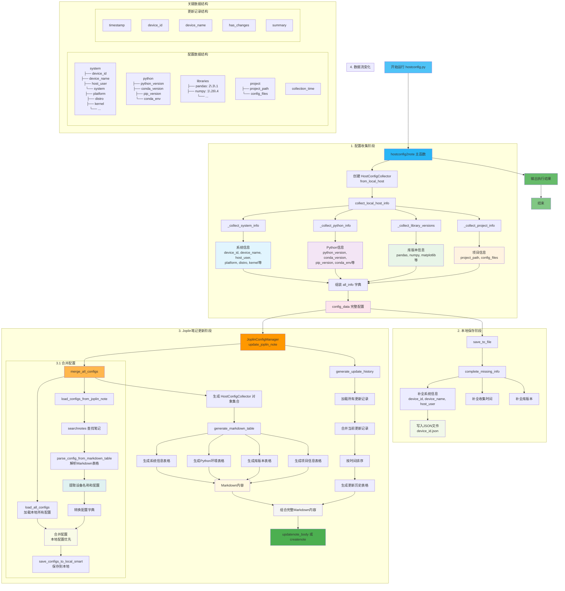
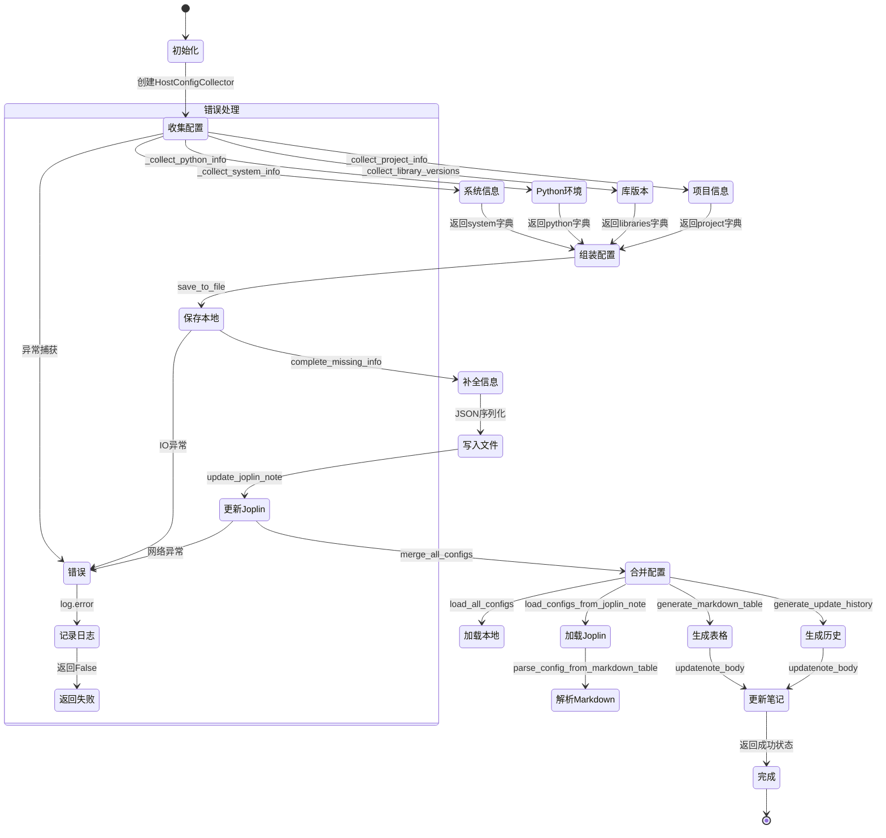

# hostconfig
主机配置自动搜集对比

```mermaid
graph TD
    A[开始运行 hostconfig.py] --> B[hostconfig2note 主函数]
    
    subgraph "1. 配置收集阶段"
        B --> C[创建 HostConfigCollector<br/>from_local_host]
        C --> D[collect_local_host_info]
        D --> E[_collect_system_info]
        D --> F[_collect_python_info]
        D --> G[_collect_library_versions]
        D --> H[_collect_project_info]
        E --> I[系统信息<br/>device_id, device_name, host_user,<br/>platform, distro, kernel等]
        F --> J[Python信息<br/>python_version, conda_version,<br/>pip_version, conda_env等]
        G --> K[库版本信息<br/>pandas, numpy, matplotlib等]
        H --> L[项目信息<br/>project_path, config_files]
        I --> M[组装 all_info 字典]
        J --> M
        K --> M
        L --> M
        M --> N[config_data 完整配置]
    end
    
    subgraph "2. 本地保存阶段"
        N --> O[save_to_file]
        O --> P[complete_missing_info]
        P --> Q[补全系统信息<br/>device_id, device_name, host_user]
        P --> R[补全收集时间]
        P --> S[补全库版本]
        Q --> T[写入JSON文件<br/>device_id.json]
    end
    
    subgraph "3. Joplin笔记更新阶段"
        N --> U[JoplinConfigManager<br/>update_joplin_note]
        U --> V[merge_all_configs]
        
        subgraph "3.1 合并配置"
            V --> W[load_all_configs<br/>加载本地所有配置]
            V --> X[load_configs_from_joplin_note]
            X --> Y[searchnotes 查找笔记]
            Y --> Z[parse_config_from_markdown_table<br/>解析Markdown表格]
            Z --> AA[提取设备名称和配置]
            AA --> AB[转换配置字典]
            W --> AC[合并配置<br/>本地配置优先]
            AB --> AC
            AC --> AD[save_configs_to_local_smart<br/>保存到本地]
        end
        
        V --> AE[生成 HostConfigCollector 对象集合]
        AE --> AF[generate_markdown_table]
        AF --> AG[生成系统信息表格]
        AF --> AH[生成Python环境表格]
        AF --> AI[生成库版本表格]
        AF --> AJ[生成项目信息表格]
        AG --> AK[Markdown内容]
        AH --> AK
        AI --> AK
        AJ --> AK
        
        U --> AL[generate_update_history]
        AL --> AM[加载所有更新记录]
        AM --> AN[合并当前更新记录]
        AN --> AO[按时间排序]
        AO --> AP[生成更新历史表格]
        
        AK --> AQ[组合完整Markdown内容]
        AP --> AQ
        AQ --> AR[updatenote_body 或 createnote]
    end
    
    subgraph "4. 数据流变化"
        style I fill:#e1f5fe
        style J fill:#f3e5f5
        style K fill:#e8f5e8
        style L fill:#fff3e0
        style N fill:#fce4ec
        style T fill:#f1f8e9
        style AA fill:#e0f2f1
        style AC fill:#f9fbe7
        style AK fill:#fff8e1
        style AQ fill:#f5f5f5
    end
    
    B --> AS[输出执行结果]
    AS --> AT[结束]
    
    subgraph "关键数据结构"
        direction LR
        subgraph "配置数据结构"
            CFG1[system<br/>├── device_id<br/>├── device_name<br/>├── host_user<br/>└── system<br/>    ├── platform<br/>    ├── distro<br/>    ├── kernel<br/>    └── ...]
            CFG2[python<br/>├── python_version<br/>├── conda_version<br/>├── pip_version<br/>└── conda_env]
            CFG3[libraries<br/>├── pandas: 2\.3\.1<br/>├── numpy: 1\.26\.4<br/>└── ...]
            CFG4[project<br/>├── project_path<br/>└── config_files]
            CFG5[collection_time]
        end
        
        subgraph "更新记录结构"
            UPD1[timestamp]
            UPD2[device_id]
            UPD3[device_name]
            UPD4[has_changes]
            UPD5[summary]
        end
    end
    
    style A fill:#4fc3f7
    style B fill:#29b6f6
    style U fill:#ff9800
    style V fill:#ffb74d
    style AR fill:#4caf50
    style AS fill:#66bb6a
    style AT fill:#81c784

```

```mermaid
stateDiagram-v2
    [*] --> 初始化
    初始化 --> 收集配置: 创建HostConfigCollector
    
    收集配置 --> 系统信息: _collect_system_info
    收集配置 --> Python环境: _collect_python_info  
    收集配置 --> 库版本: _collect_library_versions
    收集配置 --> 项目信息: _collect_project_info
    
    系统信息 --> 组装配置: 返回system字典
    Python环境 --> 组装配置: 返回python字典
    库版本 --> 组装配置: 返回libraries字典
    项目信息 --> 组装配置: 返回project字典
    
    组装配置 --> 保存本地: save_to_file
    保存本地 --> 补全信息: complete_missing_info
    补全信息 --> 写入文件: JSON序列化
    
    写入文件 --> 更新Joplin: update_joplin_note
    更新Joplin --> 合并配置: merge_all_configs
    
    合并配置 --> 加载本地: load_all_configs
    合并配置 --> 加载Joplin: load_configs_from_joplin_note
    加载Joplin --> 解析Markdown: parse_config_from_markdown_table
    
    合并配置 --> 生成表格: generate_markdown_table
    合并配置 --> 生成历史: generate_update_history
    
    生成表格 --> 更新笔记: updatenote_body
    生成历史 --> 更新笔记: updatenote_body
    
    更新笔记 --> 完成: 返回成功状态
    完成 --> [*]
    
    state 错误处理 {
        收集配置 --> 错误: 异常捕获
        保存本地 --> 错误: IO异常
        更新Joplin --> 错误: 网络异常
        错误 --> 记录日志: log.error
        记录日志 --> 返回失败: 返回False
    }

```

