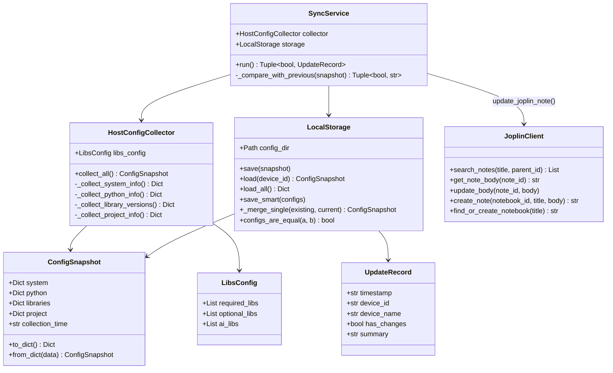
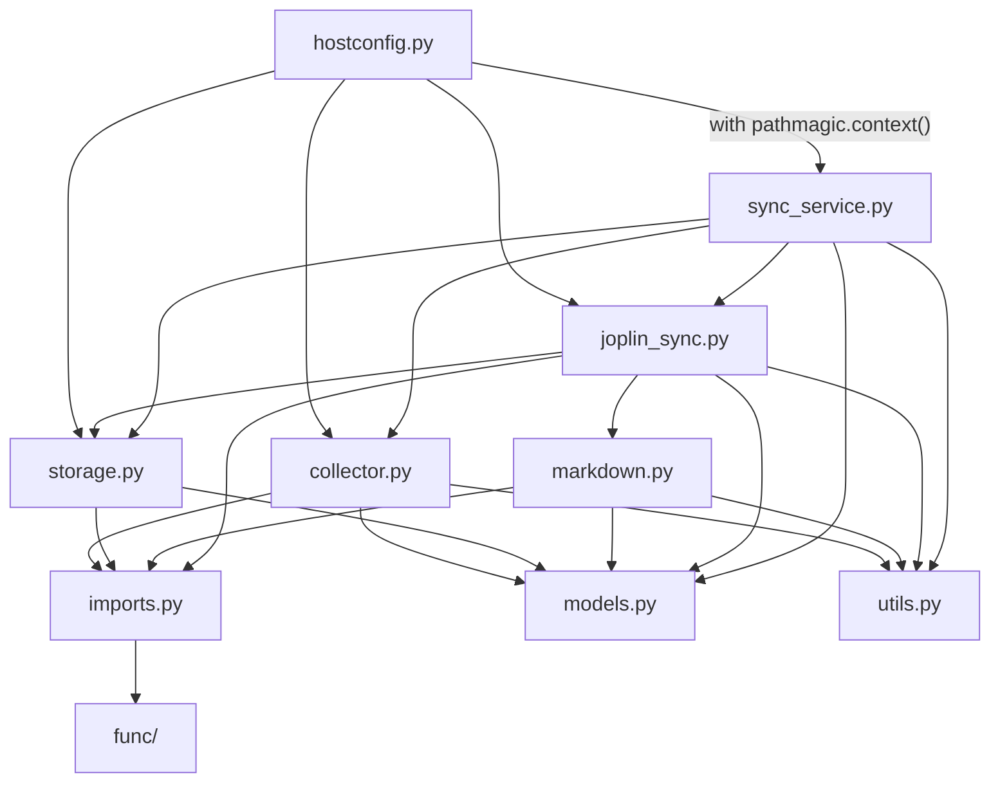
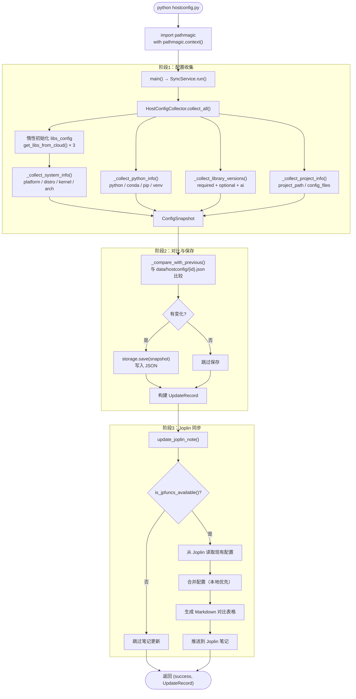
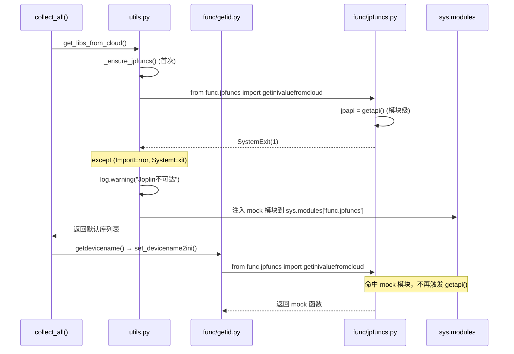
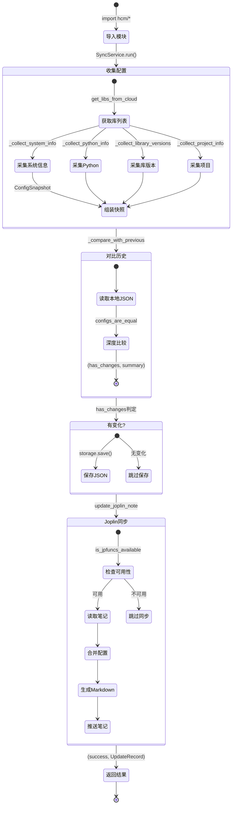
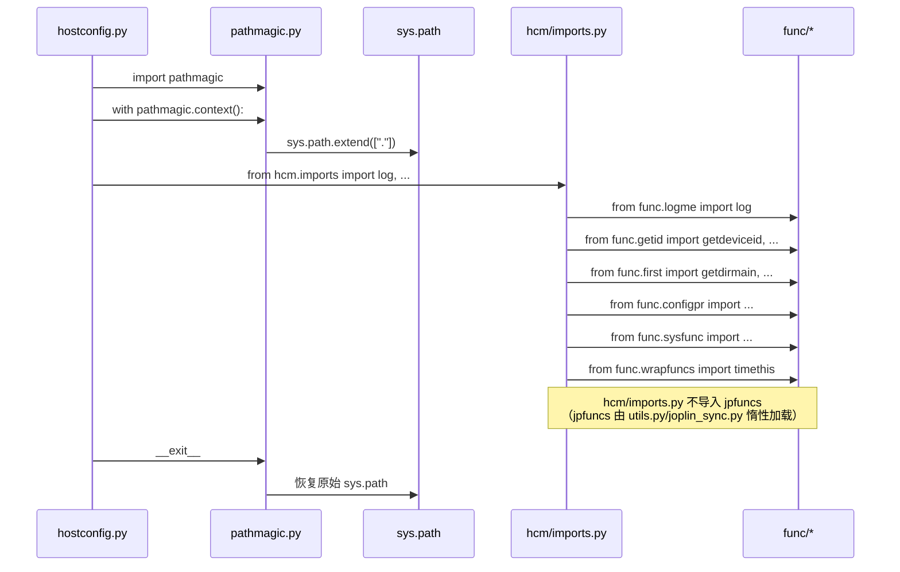
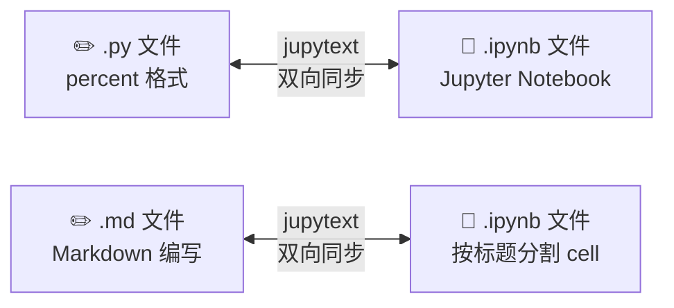

---
jupyter:
  jupytext:
    cell_metadata_filter: -all
    formats: ipynb,md
    notebook_metadata_filter: jupytext,-kernelspec
    split_at_heading: true
    text_representation:
      extension: .md
      format_name: markdown
      format_version: '1.3'
      jupytext_version: 1.19.1
---

# 技术手册

<!--
jupyter:
  jupytext:
    cell_metadata_filter: -all
    formats: ipynb,md
    notebook_metadata_filter: jupytext,-kernelspec
    text_representation:
      extension: .md
      format_name: markdown
      format_version: '1.3'
-->

hostconfig 项目技术手册，涵盖架构设计、运作逻辑、数据流转与状态机。

---

## 项目概述

hostconfig 是一个跨平台（Linux / Windows / macOS）主机配置自动收集与对比工具。收集各主机的系统信息、Python 环境、库版本和项目配置，保存到本地 JSON 文件，并自动同步到 Joplin 笔记中，生成多主机配置对比表格。

---

## 项目结构

```
hostconfig/                    # 项目根
├── hostconfig.py              # 唯一主入口（~55行）
├── hostconfig.ipynb           # jupytext 同步
├── pathmagic.py               # 路径魔法上下文管理器
├── hcm/                       # 功能模块（数据+逻辑，无I/O边界）
│   ├── __init__.py
│   ├── imports.py             # 集中导入func子模块
│   ├── models.py              # 纯数据类：ConfigSnapshot / UpdateRecord / LibsConfig
│   ├── collector.py           # 配置收集器
│   ├── storage.py             # JSON持久化 + 合并 + 智能保存
│   ├── markdown.py            # Markdown解析/生成（纯函数）
│   ├── joplin_sync.py         # Joplin API薄封装 + 笔记更新流程
│   ├── sync_service.py        # 编排器：串联收集→对比→保存→同步
│   └── utils.py               # 辅助函数 + jpfuncs导入守卫
├── func/                      # Git子模块：工具函数库
├── data/                      # 配置数据和快照
│   ├── happyjp.ini            # Joplin API连接配置
│   ├── happyjphard.ini        # 硬件参数
│   ├── happyjpinifromcloud.ini# 云端设备映射表
│   ├── happyjpsys.ini         # 系统开关
│   └── hostconfig/            # 配置快照JSON
├── docs/                      # 文档
├── log/                       # 日志
├── rootfile                   # 项目根定位标记
└── jupytext.toml              # Jupytext配置
```

---

## 核心架构



### 模块职责

| 模块 | 职责 |
|:---|:---|
| `hcm/imports.py` | 集中导入 func 子模块（log、getid、configpr、sysfunc、wrapfuncs），hcm 其他模块统一从此获取 |
| `hcm/models.py` | 纯数据类（dataclass），零依赖。`ConfigSnapshot` / `UpdateRecord` / `LibsConfig` |
| `hcm/collector.py` | `HostConfigCollector`：采集系统/Python/库/项目四维度信息，惰性初始化 libs_config |
| `hcm/storage.py` | `LocalStorage`：JSON 读写、多主机配置合并、智能保存（按时间戳比较）、旧文件清理 |
| `hcm/markdown.py` | 纯函数：`parse_table()` 反向解析 Markdown 表格，`generate_table()` / `generate_update_history()` 生成 |
| `hcm/joplin_sync.py` | `JoplinClient`（API 薄封装）+ `update_joplin_note()`（笔记同步流程） |
| `hcm/sync_service.py` | `SyncService`：编排器，串联收集→对比→保存→Joplin同步全流程 |
| `hcm/utils.py` | `get_libs_from_cloud()` 库列表获取、`format_timestamp()` 格式化、`is_jpfuncs_available()` 可用性判断 |

---

## 依赖关系



### 关键设计决策

1. **无 mock 兜底**：func 子模块是硬依赖，不存在就报错，不做降级
2. **pathmagic 只使用一次**：在 `hostconfig.py` 入口激活，hcm 全员共享
3. **jpfuncs 惰性导入**：`func/jpfuncs.py` 在模块级别执行 `jpapi = getapi()`，Joplin 不可达时 raise `SystemExit`。hcm 通过 `_ensure_jpfuncs()` 统一管理导入，失败后注入 mock 模块到 `sys.modules`，阻止重复触发 `getapi()`
4. **hcm/ 只有数据和逻辑**：无路径管理、无防御代码

---

## 主流程数据流



---

## jpfuncs 导入守卫机制



`func/jpfuncs.py` 在模块级执行 `jpapi = getapi()`，Joplin 不可达时调用 `exit(1)` 抛出 `SystemExit`。Python 的导入机制会从 `sys.modules` 中移除加载失败的模块，导致后续任何 `from func.jpfuncs import X` 重新执行模块体、再次触发 `getapi()`。

`hcm/utils.py` 的 `_ensure_jpfuncs()` 在首次导入失败后注入 mock 模块占据 `sys.modules['func.jpfuncs']`，所有后续导入（包括 `getid.py`、`sysfunc.py`、`joplin_sync.py` 中的懒加载）直接命中 mock，`jpapi = getapi()` 副作用只执行一次。

---

## 状态机



---

## 数据结构

### ConfigSnapshot（配置快照）

```json
{
  "system": {
    "device_id": "0x1070835fe6e5d115",
    "device_name": "HCX_other",
    "host_user": "HCX_other(baiyefeng)",
    "timestamp": "2026-05-18T19:12:55",
    "system": {
      "platform": "Linux-4.15.0-249-generic",
      "system": "Linux",
      "release": "4.15.0-249-generic",
      "machine": "x86_64",
      "processor": "x86_64",
      "architecture": ["64bit", "ELF"],
      "distro": "Ubuntu 20.04 LTS",
      "kernel": "4.15.0-249-generic"
    }
  },
  "python": {
    "python_version": "3.10.0",
    "python_implementation": "CPython",
    "conda_version": "conda 23.1.0",
    "pip_version": "pip 23.0.1",
    "virtual_env": "N/A",
    "conda_env": "base"
  },
  "libraries": {
    "pandas": "2.3.1",
    "numpy": "1.26.4"
  },
  "project": {
    "project_path": "/data/codebase/hostconfig",
    "config_files": {}
  },
  "collection_time": "2026-05-18T19:12:55"
}
```

### UpdateRecord（更新记录）

```json
{
  "timestamp": "2026-05-18 19:12",
  "device_id": "0x1070835fe6e5d115",
  "device_name": "HCX_other",
  "has_changes": true,
  "summary": "配置变化: system, python, libraries"
}
```

---

## 配置文件体系

| 文件 | 格式 | 用途 |
|:---|:---|:---|
| `data/happyjp.ini` | INI | Joplin API 连接配置（云端INI ID） |
| `data/happyjphard.ini` | INI | 硬件参数（device_id → device_name 映射） |
| `data/happyjpinifromcloud.ini` | INI | 云端设备映射表（设备名 → device_id），支持多平台同步 |
| `data/happyjpsys.ini` | INI | 系统开关（如 `FORCE_UPDATE=true`） |
| `data/joplinai.ini` | INI | 远程 Joplin 配置（func 最新版支持，可选） |
| `rootfile` | 空文件 | 项目根目录定位标记，`func/first.py` 向上查找此文件 |

---

## 导入机制



- `pathmagic.py` 通过上下文管理器临时将项目根目录加入 `sys.path`
- `hcm/imports.py` 集中导入 func 无副作用模块，hcm 其他模块统一引用
- `func/jpfuncs.py` 有模块级 `jpapi = getapi()` 副作用，采用惰性导入 + mock 注入守卫
- 不做 mock 降级：func 子模块不存在就报错

---

## 关键函数

| 函数 | 所在模块 | 说明 |
|:---|:---|:---|
| `HostConfigCollector.collect_all()` | collector.py | 收集全部主机配置，返回 `ConfigSnapshot` |
| `LocalStorage.save()` | storage.py | 保存单个配置快照到 `{device_id}.json` |
| `LocalStorage.configs_are_equal()` | storage.py | 深度比较两个快照是否相等 |
| `parse_table(md)` | markdown.py | 从 Markdown 反向解析配置和更新记录 |
| `generate_table(configs)` | markdown.py | 生成多主机 Markdown 对比表格 |
| `update_joplin_note()` | joplin_sync.py | 将配置同步到 Joplin 笔记 |
| `SyncService.run()` | sync_service.py | 编排全流程，返回 `(success, UpdateRecord)` |
| `_ensure_jpfuncs()` | utils.py | jpfuncs 导入守卫，确保 `getapi()` 只执行一次 |
| `is_jpfuncs_available()` | utils.py | 查询 jpfuncs 是否真实可用 |
| `get_libs_from_cloud(key)` | utils.py | 获取云端库监测列表 |
| `format_timestamp(ts)` | utils.py | ISO 时间戳格式化 |

---

## Jupytext 同步机制



- 项目级配置：`jupytext.toml`（`formats = "ipynb,py:percent"`）
- `.py` 文件 `# %%` 分隔 cell，`.md` 文件按 `#` 标题分割 cell
- 编辑 `.py`/`.md` → JupyterLab 打开 `.ipynb` 自动同步

---

## 更新记录

| 日期 | 变更类型 | 说明 |
|:---|:---|:---|
| 2026-05-18 | 重构 | 将 ~1970 行 hostconfig.py 拆分为 hcm/ 子目录 9 个模块；去除 mock 机制；增加 jpfuncs 导入守卫 |
| 2026-05-16 | 文档 | 创建技术手册，含架构图、数据流图、状态机图、类图、序列图 |
